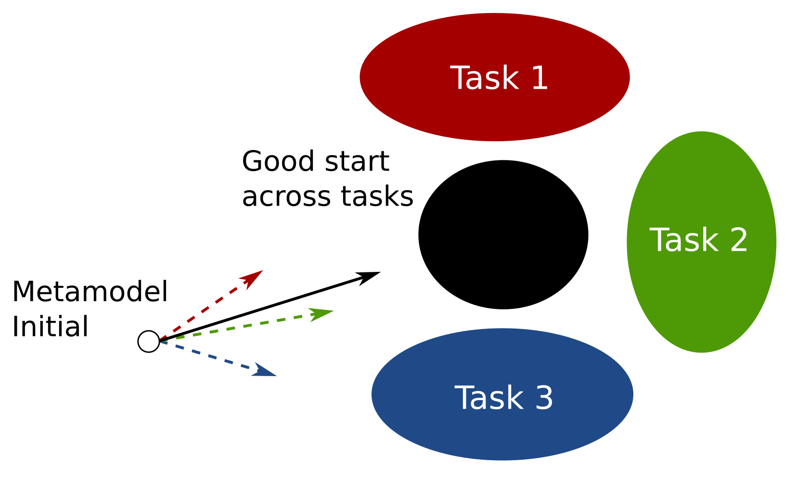
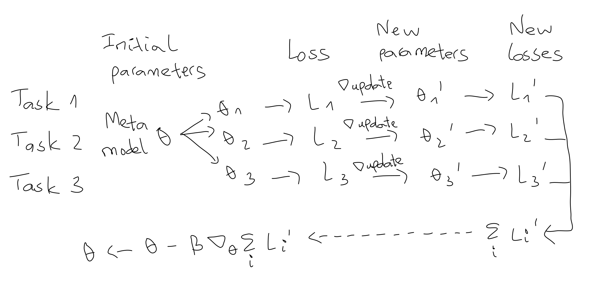
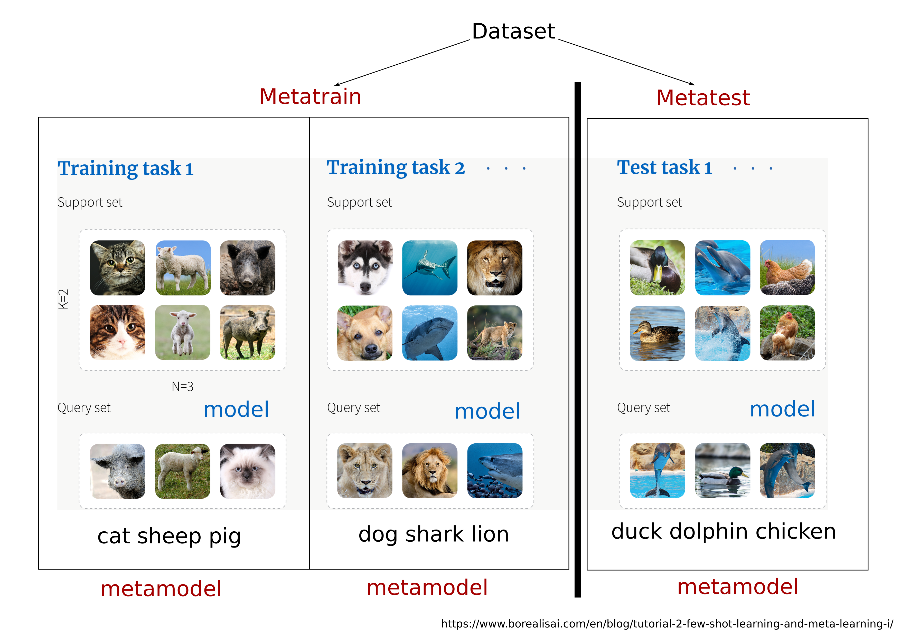

Implementation of Reptile <a href="#References">[1]</a> in PyTorch.

Meta learning can be understood as finding an efficient model training procedure.
For this purpose, the Reptile algorithm attempts to find good model parameter initilization.
A good parameter initialization here means the parameters can be easily adapted for many tasks, after a few update steps.
Reptile is a variant of fo-MAML <a href="#References">[2]</a> (1st order Model Agnostic Meta Learning)

Intuition for Reptile and MAML:

Figure by author.

Overview of MAML algorithm:

Figure by author.

Few shot episode setting:

Adapted from https://www.borealisai.com/en/blog/tutorial-2-few-shot-learning-and-meta-learning-i/

## Basic usage

### Input

Critical input variables are at the top of the Jupyter notebook or python script in the `src` folder.
By default, expected input are images and a label file.
`datadir` contains an `images` folder with all images in flat structure, i.e. as direct children.
`datadir` also contains a metadata file, having at least 2 columns: filename and label.
The column names are specified by 2 variables: 
`filecolumn, labelcolumn`

An example is in the link below. `info.json` file is ignored.

https://github.com/ihsanullah2131/metadl_contrib/tree/master/DataFormat/mini_insect_3

 

`resultdir`: location to save result

`dataname`: result are saved in this folder inside the resultdir

`resultprefix`: prefix for output file
 
 `random_seed`: can be set to None

### Output

Evaluation metrics are saved in a `assessment.csv` file in `resultdir/metric`.

The meta model is saved in `resultdir/model`

## References

[1]Reptile:
https://arxiv.org/abs/1803.02999

[2]MAML:
http://proceedings.mlr.press/v70/finn17a

Inspired by 
https://github.com/gebob19/REPTILE-Metalearning/blob/master/omniglot_trainer.ipynb

## Related links
Baseline models are here:
https://github.com/phanav/benchmark
